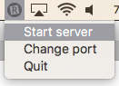
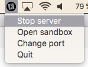
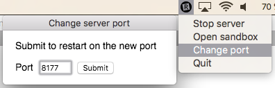

# Rempl server GUI

The app allows to control [Rempl](https://github.com/rempl/rempl) server.







## Usage

```shell
npm install electron -g
npm install
npm start
```
or create executable file for your OS

### Mac OS executable
```bash
npm run build
```

### Windows executable
```bash
npm run build-win
```
